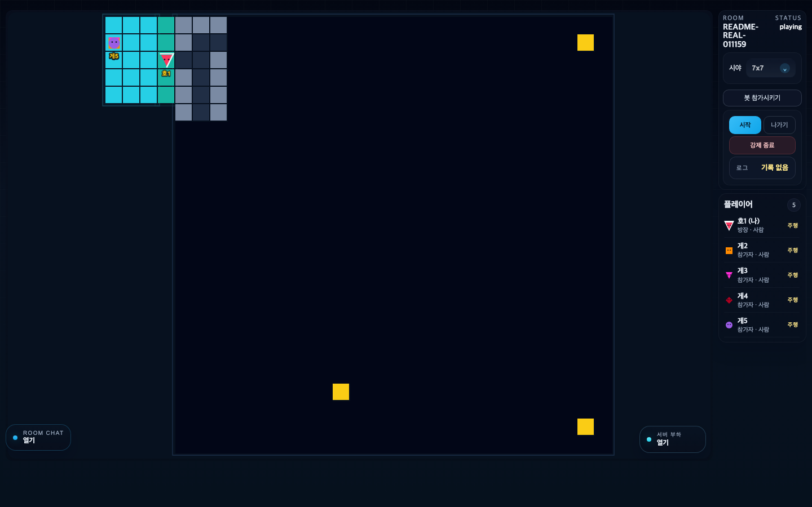
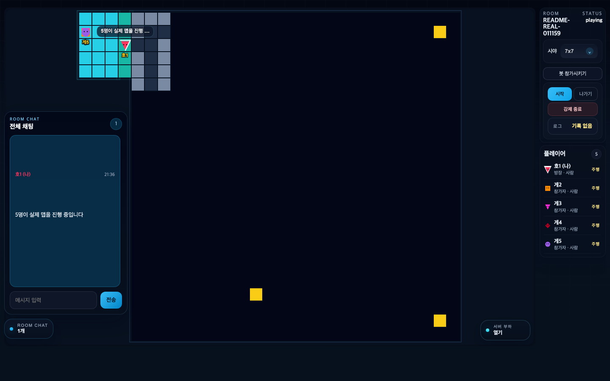
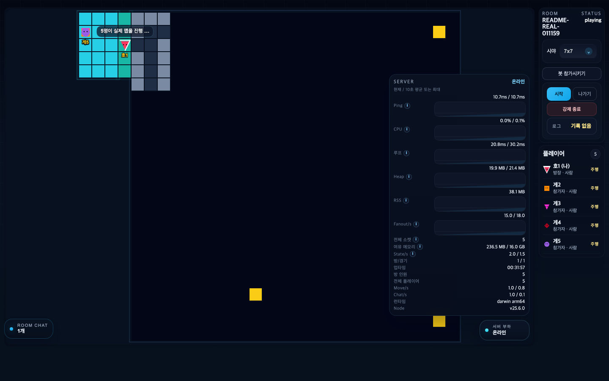
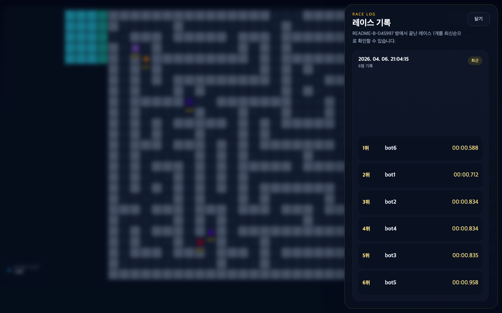
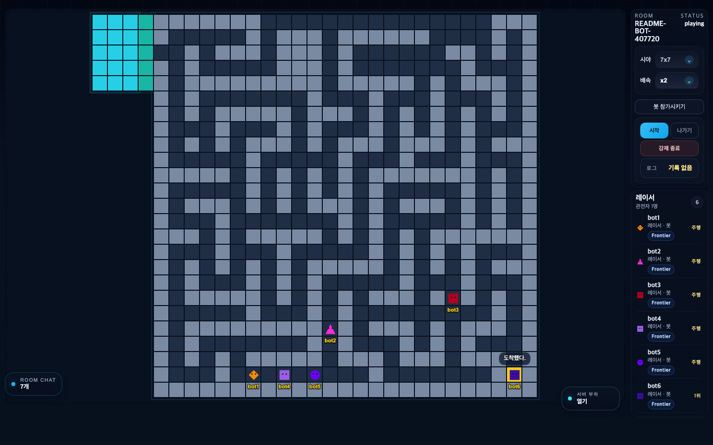
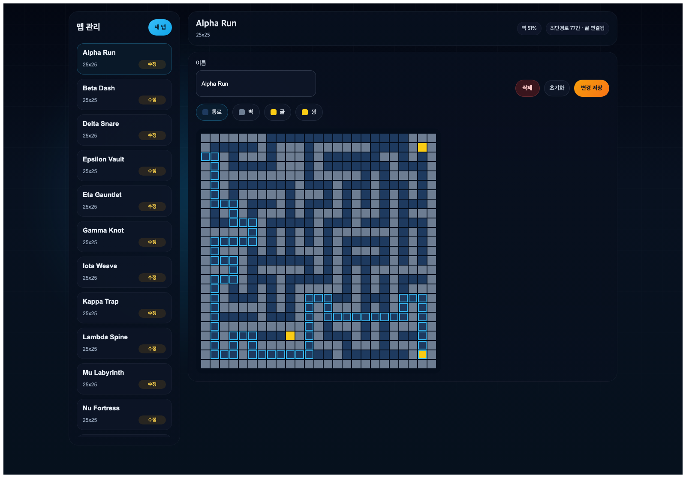

# Fog Maze Race

여러 사용자가 제한된 시야 안에서 같은 미로를 달리는 실시간 멀티 레이스 게임입니다.

- 배포 URL: [https://fog-maze-race.onrender.com](https://fog-maze-race.onrender.com)
- `Render Free` 환경이라 첫 접속 시 콜드 스타트로 수십 초 정도 걸릴 수 있습니다.

- `Fastify + Socket.IO` authoritative 서버
- `React + PixiJS` 기반 웹 클라이언트
- 공유 계약과 맵 정의를 가진 모노레포 구조
- 관리자 맵 편집 기능 제공
- 방 단위 레이스 로그 패널 제공

## 화면 미리보기

### 게임 화면
일반 방에서 레이스가 진행되는 기본 화면입니다. 중앙 맵, 우측 상태 패널, 방장 액션을 한 화면에서 확인할 수 있습니다.



### 채팅 패널
방 안에서 실시간 채팅을 열고 짧은 메시지를 주고받을 수 있습니다.



### 서버 부하 패널
방장은 서버 핑, CPU, 이벤트 루프 지연, 메모리 사용량을 바로 확인할 수 있습니다.



### 레이스 로그 패널
최근 라운드 기록을 별도 패널에서 다시 열어보고 순위와 기록 시간을 확인할 수 있습니다.



### 봇 전용 방
봇 전용 방에서는 배속 조절, 봇 추가, 전략 선택을 한 패널에서 관리할 수 있습니다.



### 맵 생성 및 수정 화면
관리자 맵 페이지에서는 25x25 맵을 생성하고, 통로/벽/가짜 골/골 타일을 직접 편집할 수 있습니다.



## 배포 환경

- 서비스 주소: [https://fog-maze-race.onrender.com](https://fog-maze-race.onrender.com)
- 배포 위치: `Render Web Service`
- 런타임: `Docker`
- 리전: `Singapore`
- 현재 배포 브랜치: `main`
- 현재 서비스 플랜: `free`
- 자동배포: GitHub Actions 성공 후 Render `checksPass`

현재 서버 런타임 정보 (`2026-04-06` `/health` 기준):

- Node.js: `v22.22.2`
- 플랫폼: `linux x64`
- 앱 프로세스 메모리(`RSS`): 약 `83 MB`
- 앱 프로세스 Heap 사용량: 약 `16 MB`

주의:

- `/health`에 보이는 `cpuCores: 8`, `totalMemoryBytes: 32GB` 같은 값은 호스트 시스템 기준 메트릭입니다.
- 이 값은 Render `free` 플랜에 앱이 독점적으로 보장받는 자원과는 다를 수 있습니다.
- 실제 운영 체감 성능은 Free 플랜 특성상 콜드 스타트와 제한된 CPU/메모리 영향이 있습니다.

## 플레이 방법

1. 배포 URL에 접속해 닉네임을 입력하고 `입장`합니다.
2. 방 목록에서 `입장`하거나 새 방을 만들어 바로 게임 화면으로 들어갑니다.
3. 방장이 `시작`을 누르면 카운트다운 뒤 레이스가 시작됩니다.
4. 미로를 통과해 골인 지점까지 먼저 도착하면 상위 순위를 차지합니다.
5. 레이스 종료 후 결과를 확인하고 `새 게임 준비`로 다음 라운드를 시작합니다.
6. 이전 경기 기록은 우측 패널의 `로그` 버튼에서 다시 볼 수 있습니다.

## 조작법

- `↑ ↓ ← →` : 한 칸씩 이동
- `Enter` 또는 `/` : 빠른 채팅 입력창 열기
- `Esc` : 빠른 채팅 입력 취소
- `시작` : 방장만 사용 가능
- `강제 종료` : 방장만 사용 가능
- `나가기` : 현재 방 즉시 퇴장

## 빠른 시작

사전 준비:

- `Node.js 22 LTS`
- `pnpm 10+`
- 최신 데스크톱 브라우저
- Docker 실행 시 `Docker` / `Docker Compose`

설치:

```bash
pnpm install
```

자주 쓰는 명령:

```bash
pnpm dev
pnpm test
pnpm test:e2e
pnpm typecheck
pnpm build
pnpm start
pnpm race:join
pnpm race:explore
pnpm race:fill
```

## 개발 모드

로컬 개발 서버와 게임 서버를 함께 실행합니다.

```bash
pnpm dev
```

기본 주소:

- 웹 클라이언트: `http://127.0.0.1:4173`
- 서버 헬스 체크: `http://127.0.0.1:3000/health`
- 관리자 맵 URL: `http://127.0.0.1:4173/admin/maps`

개발 모드에서 웹은 Vite 프록시를 통해 `3000` 포트 서버와 통신합니다.

## 최근 UI 동작

- 레이스 종료 결과 모달은 `현재 라운드` 결과만 표시합니다.
- 방 안에서 끝난 최근 레이스 결과는 우측 패널의 `로그` 버튼으로 다시 확인할 수 있습니다.
- 가짜 골에 도착했을 때 뜨는 `쿠!` 알림은 시작 구역이 아닌 실제 미로 판(`mazeZone`) 중심을 기준으로 표시됩니다.

## Codex 레이스 봇

게임 방에 자동으로 참가시켜 함께 테스트하거나 플레이할 수 있는 CLI 봇을 제공합니다.

기본 실행:

```bash
pnpm race:join
```

탐험형 봇 실행:

```bash
pnpm race:explore
```

내가 만든 봇 전용 방 자동 채우기:

```bash
pnpm race:fill -- --room Alpha --count 3 --names red,blue,green
```

자주 쓰는 예시:

```bash
RACE_BOT_COUNT=2 pnpm race:join
RACE_BOT_ROOM=Alpha pnpm race:join
RACE_BOT_JOIN_MESSAGE="들어왔다." RACE_BOT_FINISH_MESSAGE="도착했다." pnpm race:join
RACE_BOT_URL=http://127.0.0.1:3000 pnpm race:join
RACE_BOT_AUTOPILOT=false pnpm race:join
RACE_BOT_ROOM=Alpha pnpm race:explore
pnpm race:fill -- --room Alpha --count 3
pnpm race:fill -- --room Alpha --names red,blue,green
pnpm race:fill -- --room Alpha --bot join --count 2
pnpm race:fill -- --room Alpha --create --count 3
```

동작 요약:

- 기본 닉네임은 `Codex`이며 서버 규칙에 맞춰 최대 5자로 사용
- `RACE_BOT_COUNT` 또는 `--count`로 여러 봇을 동시에 띄울 수 있음
- 지정한 방 이름이 있으면 해당 `waiting` 방만 기다렸다가 입장
- 방 이름을 지정하지 않으면 첫 번째 `waiting` 방에 입장
- 기본적으로 방 입장 시 `들어왔다.`, 완주 시 `도착했다.` 채팅을 자동 전송
- `playing` 상태가 되면 기본적으로 목표 지점까지 자동 주행
- 표준 입력으로 `status`, `chat <메시지>`, `auto on`, `auto off`, `leave`, `quit` 명령 사용 가능
- `pnpm race:fill`의 기본 동작은 내가 UI에서 만든 `waiting` 방을 기다렸다가 봇만 자동으로 채우는 것임
- `--create`는 보조 옵션이며, 이 경우 봇 매니저가 직접 `bot_race` 방을 만들고 호스트를 가져감
- `--names`를 주면 그 이름들을 우선 사용하고, 이름 수가 `--count`보다 많으면 이름 수에 맞춰 자동으로 인원 수가 늘어남
- `pnpm race:fill` 실행 중 표준 입력으로 `status`, `start`, `chat <메시지>`, `leave`, `quit` 명령 사용 가능
- 방 안에서는 방장이 UI로 봇 종류와 이름을 편집해 직접 추가하고, 현재 봇을 개별/일괄 제거할 수 있음
- `bot_race` 방장이 `waiting` 상태에서 봇 배속을 `x1`부터 `x6`까지 바꿀 수 있고, `join`/`explore` 봇 모두 기본 간격은 `180ms`를 사용함
- 탐험형 봇은 방장 UI에서 봇마다 전략을 따로 고를 수 있고, 현재는 `frontier`, `tremaux`, `wall` 전략을 지원함
- 일반 방에서는 사람과 같이 뛰는 봇을 추가하고, 봇 전용 방에서는 관전 상태를 유지한 채 봇만 채울 수 있음
- `bot_race`에서는 사람 관전자가 레이서 목록에 들어가지 않고, 우측 리스트는 봇 레이서만 보여줌
- `bot_race`의 사람 관전자는 채팅은 계속 가능하고, 레이스 시작/재시작은 방장이 UI에서 직접 수행함
- `bot_race`는 사람 관전자가 레이서 슬롯을 먹지 않으므로 `최대 15봇 + 사람 관전자` 구성이 가능함
- 탐험형 봇은 goal을 처음부터 보지 않고, 현재 시야에 들어온 타일만 기억하면서 전략별 탐험 정책으로 움직임
- `frontier`는 현재 시야 기준의 미지 경계(frontier)를 넓게 찾아가는 기본 전략이고, `tremaux`는 이미 지난 통로를 더 강하게 피해서 반복을 줄이는 전략이며, `wall`은 최근 진행 방향 기준으로 한쪽 손 우선 순서를 유지하며 벽을 더듬듯 탐험하는 전략임
- 탐험형 봇 seed는 닉네임 고정값이 아니라 매 경기 새로 다시 배정되며, 같은 경기 안에서는 균등하게 퍼진 seed 묶음을 나눠 받아 같은 이름이어도 판마다 경로가 달라짐
- 탐험형 봇은 모든 레이서가 같은 시작 슬롯에서 출발하더라도, seed별 진입 행과 근접 후보군 분산, 넓은 시야에서의 동점 goal 경로 분산으로 움직임이 갈라짐
- 최근 경로 패널티와 막힌 방향 벽 학습으로 3x3 시야에서 왕복 루프를 줄임
- 마지막 사람 플레이어가 방을 떠나면 남아 있는 봇은 서버에서 함께 정리됨

닉네임 참고:

- 서버 닉네임 제한이 5자라서 기본 멀티 봇일 때는 `bot1`, `bot2`, `bot3`처럼 생성됩니다.

UI 기준 빠른 사용 흐름:

1. 웹 UI에서 일반 방 또는 `봇 전용 방`을 만듭니다.
2. 방에 들어간 뒤, 방장만 보이는 `봇 참가시키기` 버튼을 눌러 패널을 엽니다.
3. 기본으로 채워진 `bot1`, `bot2` 같은 이름을 수정하거나 그대로 사용합니다.
4. `bot_race`라면 방장 UI에서 배속을 `x1`부터 `x6`까지 고를 수 있습니다.
5. 탐험형을 선택했다면 각 봇 행마다 `frontier`, `tremaux`, `wall` 전략을 따로 고를 수 있습니다.
6. `bot_race`에서는 사람은 관전 상태로 남고, 우측 `레이서` 목록에는 실제 봇 레이서만 표시됩니다.

자세한 사용법은 [Codex 레이스 봇 가이드](./docs/race-bot.md) 참고.

## Docker / Compose

단일 컨테이너가 웹 정적 파일과 API/WebSocket 서버를 함께 제공합니다.

```bash
pnpm docker:build
pnpm docker:up
pnpm docker:ps
pnpm docker:logs
pnpm docker:stop
pnpm docker:remove
```

기본 Compose 포트:

- 웹 + API + WebSocket: `http://127.0.0.1:3300`
- 관리자 맵 URL: `http://127.0.0.1:3300/admin/maps`

맵 편집 데이터는 `./data` 디렉터리를 컨테이너의 `/app/data`에 마운트해 유지합니다.

## LAN 접속

`pnpm dev`의 웹 서버는 기본적으로 `0.0.0.0`에 바인딩되어 같은 공유기 안의 다른 기기에서 접속할 수 있습니다.

- 로컬 개발 서버 예시: `http://<내_LAN_IP>:4173`
- Docker Compose 예시: `http://<내_LAN_IP>:3300`

접속이 안 되면 다음을 먼저 확인합니다.

- 현재 머신의 LAN IP를 확인했는지
- 서버가 실제로 실행 중인지
- macOS 방화벽이 로컬 인바운드를 막고 있지 않은지
- 공유기에 AP 격리 같은 설정이 켜져 있지 않은지

## 프로덕션 실행

프로덕션 산출물을 만든 뒤 서버가 정적 웹 자산까지 함께 서빙합니다.

```bash
pnpm build
pnpm start
```

현재 운영 구조:

- `apps/server`가 `apps/web/dist`를 정적으로 서빙
- `Socket.IO`는 페이지와 같은 오리진 사용
- 단일 인스턴스 전제
- 관리자 맵 데이터는 기본적으로 `data/maps.json` 사용

## 프로젝트 구조

```text
apps/server      Fastify + Socket.IO 서버
apps/web         React + PixiJS 클라이언트
packages/shared  공유 계약, 도메인 타입, 맵/시야 규칙
tests/e2e        Playwright 종단간 테스트
scripts/docker   Docker Compose 제어 스크립트
specs            기능 명세와 상세 설계 문서
```

## 환경변수

현재 저장소에는 `.env` 파일이 없고, `.env` 및 `.env.*`는 Git 업로드 제외 대상입니다. 필요하면 셸 환경변수나 Docker Compose 변수로 주입하면 됩니다.

| 변수명 | 용도 | 기본값 |
| --- | --- | --- |
| `PORT` | 서버 포트 | `3000` |
| `APP_VERSION` | `/health` 응답 버전 문자열 | `dev` |
| `MAP_STORE_PATH` | 관리자 맵 JSON 저장 위치 | `data/maps.json` |
| `WEB_DIST_PATH` | 서버가 서빙할 웹 빌드 산출물 경로 | `apps/web/dist` |
| `VITE_HOST` | 개발용 Vite 바인딩 호스트 | `0.0.0.0` |
| `VITE_PORT` | 개발용 웹 포트 | `4173` |
| `VITE_PROXY_TARGET` | 개발용 API/WebSocket 프록시 대상 | `http://127.0.0.1:3000` |
| `APP_PORT` | Docker Compose 호스트 공개 포트 | `3300` |
| `RACE_BOT_URL` | `pnpm race:join`, `pnpm race:explore` 대상 서버 URL | `http://127.0.0.1:3000` |
| `RACE_BOT_NICKNAME` | 봇 닉네임 | `Codex` |
| `RACE_BOT_COUNT` | 동시에 띄울 봇 수 | `1` |
| `RACE_BOT_ROOM` | 참가를 기다릴 방 이름 | 없음 |
| `RACE_BOT_NAMES` | `race:fill`에서 우선 사용할 봇 이름 목록 (`쉼표 구분`) | 없음 |
| `RACE_BOT_JOIN_MESSAGE` | 입장 직후 보낼 채팅 메시지 | `들어왔다.` |
| `RACE_BOT_FINISH_MESSAGE` | 완주 시 보낼 채팅 메시지 | `도착했다.` |
| `RACE_BOT_GREETING` | 구버전 입장 메시지 별칭 | `RACE_BOT_JOIN_MESSAGE` 참조 |
| `RACE_BOT_AUTOPILOT` | 자동 주행 사용 여부 (`false`면 비활성화) | `true` |
| `RACE_FILL_CREATE` | `race:fill`에서 봇 전용 방을 직접 생성할지 여부 | `false` |
| `RACE_FILL_BOT_KIND` | `race:fill`이 띄울 봇 종류 (`explore` 또는 `join`) | `explore` |
| `RACE_FILL_HOST_NICKNAME` | `race:fill` 컨트롤러 닉네임 | `host` |
| `RACE_FILL_TIMEOUT_MS` | `race:fill` 대기 제한 시간 | `30000` |

추가 서버 조정 변수:

- `COUNTDOWN_STEP_MS`
- `RESULTS_DURATION_MS`
- `RECOVERY_GRACE_MS`
- `FORCED_MAP_ID`

## 테스트

```bash
pnpm test
pnpm test:e2e
pnpm typecheck
```

검증 범위:

- 공유 도메인 규칙과 계약 테스트
- 서버 도메인/HTTP/실시간 계약 테스트
- 웹 UI와 게임 렌더링 테스트
- Playwright 기반 멀티 클라이언트 E2E 시나리오
- Docker 제어 스크립트 테스트

## 상세 문서

- [초기 MVP 명세서](./docs/mvp-initial-spec.md)
- [Speckit 작업 절차](./docs/speckit-workflow.md)
- [Render 배포 가이드](./docs/deploy-render.md)
- [Codex 레이스 봇 가이드](./docs/race-bot.md)
- [빠른 시작](./specs/001-fog-maze-race/quickstart.md)
- [기능 명세](./specs/001-fog-maze-race/spec.md)
- [실시간 이벤트 계약](./specs/001-fog-maze-race/contracts/realtime-events.md)
- [HTTP 엔드포인트 계약](./specs/001-fog-maze-race/contracts/http-endpoints.md)
- [스냅샷 계약](./specs/001-fog-maze-race/contracts/snapshots.md)
